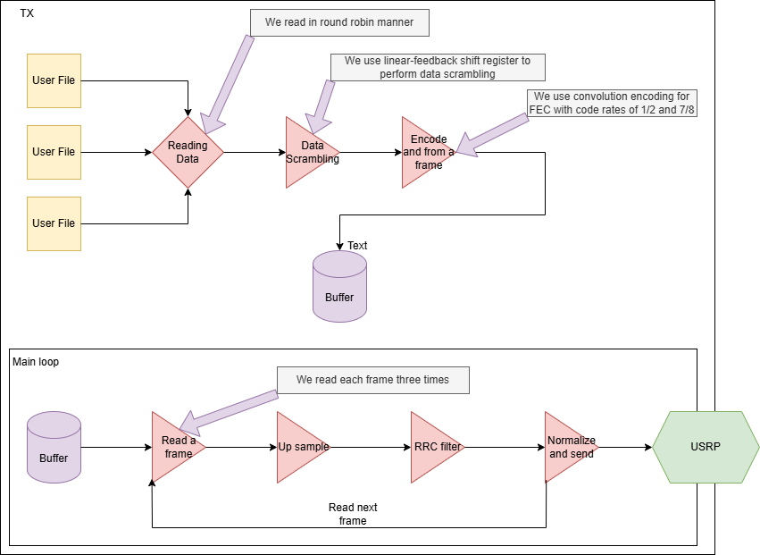
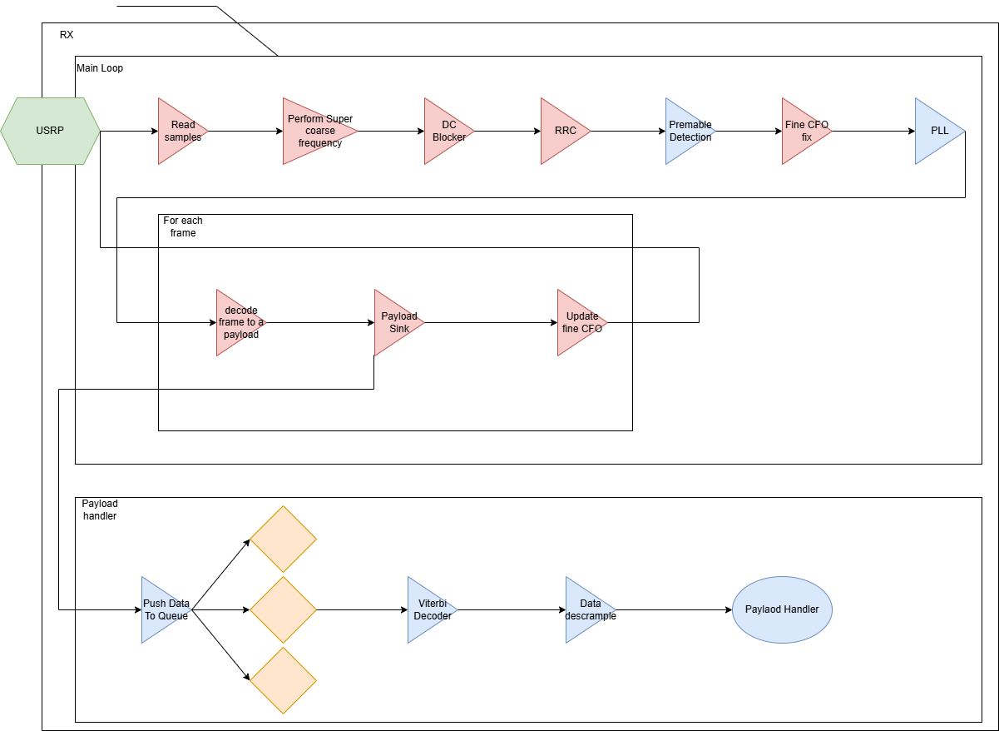
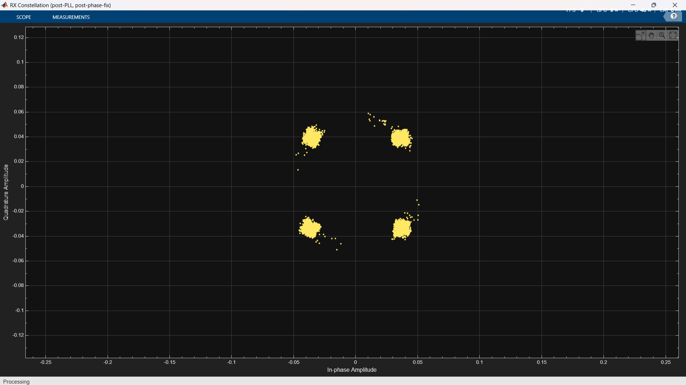
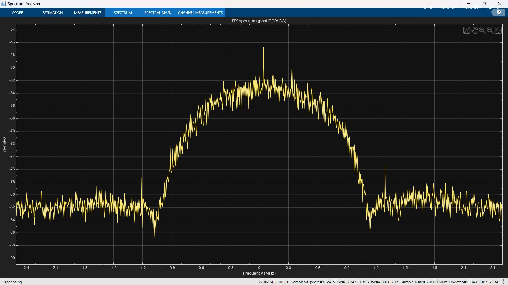
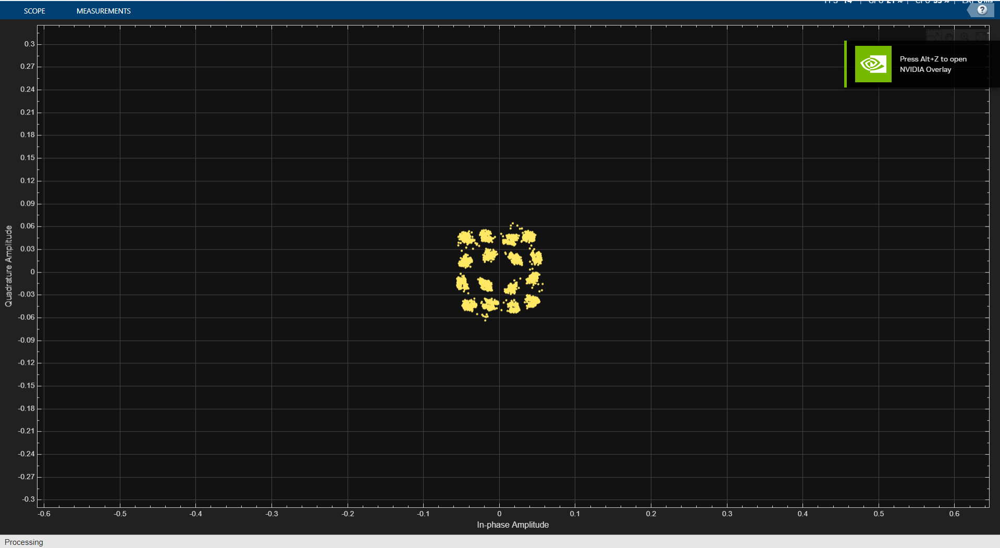
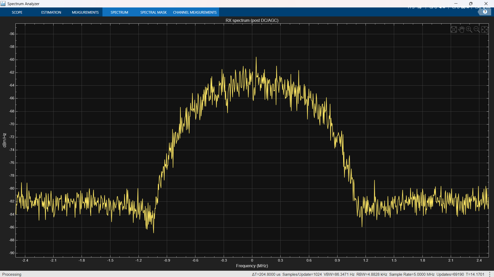

# Shirzad

Shirzad is a **unidirectional SDR link** (TX → air → RX) built around a simple idea:

- **Sources** produce data (bytes).
- **Sinks** consume data (either as RF samples going into the USRP, or decoded user payload coming out on RX).

Most of the “orchestration” is in MATLAB, and the heavy/hot-path payload work on RX is pushed to a C++ backend (workers). The main runtime knobs (sample rate, modulation, frame sizes, AGC, PLL loop BW, etc.) live in `phyAppConfig.m`.

---

## Big picture

### Architecture diagrams

TX and RX at a glance:

**TX architecture**  

**RX architecture**  

---

## TX side (bytes → symbols → USRP)

1. Read bytes from a set of `io.Reader`s (round robin).
2. Wrap the bytes into a small protocol called a **Datagram**.
3. Scramble the datagram bytes (avoid long runs of 0/1 → reduce DC/pathological patterns).
4. Build a **Frame**: preamble + payload (pilot bits + encoded data + padding).
5. Convolutional FEC encode (rate 1/2 implemented + tested; 7/8 exists but not fully battle-tested).
6. Add a **pilot amplitude / DC-ish offset** (helps coarse CFO logic on RX).
7. Upsample + RRC filter.
8. Normalize (cap amplitude) and stream to USRP.

TX repeats each frame multiple times because the link is **uni-directional** (no ACK/ARQ).

---

## RX side (USRP → symbols → bytes → workers)

1. Read complex baseband from the USRP (and detect **overruns**).
2. Super-coarse CFO correction at sample-rate (FFT/peak-based “big hammer”).
3. DC blocker (“subtract mean” style) + AGC (early stage).
4. Matched filter (RRC).
5. Schmidl & Cox repeated-preamble detector → candidate start locations + coarse CFO estimate.
6. CFO correction at **symbol rate** for candidate streams.
7. Verify preamble by correlating with the known preamble.
8. Remove constant phase (from correlation phase).
9. Run decision-directed PLL (carrier sync) on payload symbols.
10. Resolve QAM/QPSK phase ambiguity using pilot bits.
11. Decode payload → pass to a **C++ payload sink**, which:
    - viterbi-decodes, descrambles, verifies checksum,
    - routes to the configured worker per `StreamId` (console/file/BER/etc.),
    - can terminate the MATLAB RX when all streams are done.

---

## Datagram protocol (application layer packet)

Each chunk read from a `Reader` becomes a datagram:

- **Byte 1:** Stream ID  
- **Byte 2–3:** Payload length  
- **Byte 4–5:** Checksum  
- **Byte 6…:** Payload bytes  

Stream ID is how RX knows *which logical stream* this payload belongs to. Checksum is used after FEC decode + descramble to verify that the recovered bytes match what TX sent.

---

## PHY frame format (what goes “over the air”)

Conceptually:

`| half-preamble | half-preamble | payload |`

And inside payload:

`| pilot bits | payload data (FEC encoded) | padding |`

Notes:
- Payload size is kept fixed (Shirzad targets **1500 bytes**, basically “ethernet-sized”). Padding exists to make the frame length consistent.
- Pilot bits exist to fix **phase ambiguity** (e.g., in QPSK/16-QAM you can be rotated by multiples of 90° and still look “valid” until you anchor it).

---

## Schmidl & Cox (how preamble detection works)

Shirzad uses a repeated preamble `[a, a]`. The classic S&C idea:

Let `r[n]` be the matched-filter output at the detection rate, and `L` be the half-preamble length (in samples of the detector domain).

Compute over a sliding window starting at `d`:

- **Correlation (repeat similarity):**  
  `P(d) = Σ_{n=0}^{L-1} conj(r[d+n]) · r[d+n+L]`

- **Power:**  
  `R(d) = Σ_{n=0}^{L-1} |r[d+n+L]|^2`

- **Metric (one common form):**  
  `M(d) = |P(d)|^2 / (R(d)^2 + ε)`

Large `M(d)` means “this looks like `[a,a]`”.

**Coarse CFO estimate from S&C** comes from the phase of `P(d)`:

- The phase difference across the repeated halves is approximately `Δφ ≈ angle(P(d))`.
- That maps to a frequency offset estimate (units depend on your sample rate / symbol rate):
  - per-sample: `ω̂ ≈ angle(P(d)) / L`  (rad/sample)
  - per-symbol if you’re already at 1 sps: same shape, different meaning

---

## CFO / phase correction model (RX intuition)

A useful mental model:

`y[n] = x[n] · e^{j(2πΔf n/Fs + φ0)} + w[n]`

RX tries to remove:
- **big Δf** first (super-coarse FFT peak),
- then **residual Δf** from S&C (symbol-rate correction),
- then **φ0** (constant phase) from preamble correlation,
- then the remaining slow drift via **decision-directed PLL**.

---

## Decision-directed PLL (carrier sync)

After constant-phase removal, you still have small frequency/phase drift. The PLL does:

1. Make a tentative decision `â[k]` from the constellation.
2. Build an error signal (typical form):  
   `e[k] = imag( r[k] · conj(â[k]) )`
3. Feed `e[k]` into a 2nd-order loop filter (proportional + integrator) to update phase/frequency estimates.
4. Rotate the next samples by the estimated carrier.

Shirzad batches payload segments (multiple accepted frames) so the “PLL pass” is efficient.

---

## C++ payload sink + workers

On RX, after MATLAB produces the payload symbols (post PLL + ambiguity resolution), it hands off decoded bits to a C++ backend:

- Viterbi decode (FEC)
- Descramble (same LFSR as TX)
- Checksum verify
- Route by `StreamId` to a worker

Example worker types:
- **Console worker:** prints a short ASCII preview of payload.
- **File assembler worker:** reassembles chunks into output files.
- **Fixed payload BER worker:** compares received datagrams to a fixed expected payload and logs BER/PER periodically.

---

## Benchmarks / performance

There are benchmark scripts (TX/RX no-USRP style) to measure max throughput per modulation on a given CPU.

CPU used in local benchmarks: **i7-10870H**.

---

## Real-world results

Tests were performed in a corridor (~90–100 m), using:
- USRP: **N210**
- Antenna: **Dipole**

Observed performance in the demo configuration:
- **Application throughput:** ~**10 Mbps** end-to-end (framing + FEC + decode included)
- **QPSK:** estimated BER ~ `1e-4`, Eb/N0 ≈ **17 dB**
- **16-QAM:** estimated BER ~ `1e-3`, Eb/N0 ≈ **7 dB**

### Receiver screenshots (constellation + spectrum)

**QPSK**
- Constellation:  
  
- Spectrum:  
  

**16-QAM**
- Constellation:  
  
- Spectrum:  
  

In all tests: text, PDF, and video were sent successfully.

---

## Notes / limitations (current behavior)

- **Overrun handling:** if RX overruns, we currently drop that chunk. In reality, some sync state should be reset because continuity is broken.
- **Frame repetition instead of ACK:** link is uni-directional, so TX repeats frames to increase the chance RX sees at least one clean copy.
- **7/8 code rate:** implemented but not as battle-tested as 1/2.

---

## Quick “where do I change things?”

- `phyAppConfig.m` is the central place for link + modulation + frame + sync settings.
- MATLAB packages you’ll see everywhere: `sources.*`, `sinks.*`, `protocol.*`, `sync.*`, `filters.*`, `fec.*`, `utils.*`, `io.*`.
- There is also a `build_all_mex.m` script in the repo for building the native parts.

---

## TODO / next steps

- Add measured Eb/N0 / Es/N0 reporting directly into the runtime logs (not just notes).
- Make overrun recovery reset the right sync state instead of just dropping.
- Add a lightweight reliability mode if bidirectional hardware becomes available (ACK/ARQ or selective repeat).
